# LeetObfuscator
```text
██╗     ███████╗███████╗████████╗
██║     ██╔════╝██╔════╝╚══██╔══╝
██║     █████╗  █████╗     ██║
██║     ██╔══╝  ██╔══╝     ██║
███████╗███████╗███████╗   ██║
╚══════╝╚══════╝╚══════╝   ╚═╝

 ██████╗ ██████╗ ███████╗██╗   ██╗███████╗ ██████╗ █████╗ ████████╗ ██████╗ ██████╗
██╔═══██╗██╔══██╗██╔════╝██║   ██║██╔════╝██╔════╝██╔══██╗╚══██╔══╝██╔═══██╗██╔══██╗
██║   ██║██████╔╝█████╗  ██║   ██║███████╗██║     ███████║   ██║   ██║   ██║██████╔╝
██║   ██║██╔══██╗██╔══╝  ██║   ██║╚════██║██║     ██╔══██║   ██║   ██║   ██║██╔══██╗
╚██████╔╝██████╔╝██║     ╚██████╔╝███████║╚██████╗██║  ██║   ██║   ╚██████╔╝██║  ██║
 ╚═════╝ ╚═════╝ ╚═╝      ╚═════╝ ╚══════╝ ╚═════╝╚═╝  ╚═╝   ╚═╝    ╚═════╝ ╚═╝  ╚═╝

A very simple obfuscator for C/C++ x64 and x86 code
```

This is made as an LLVM fork, so you need the actual source to obfuscate. It's not an arbitrary executable obfuscator. It's a modified version of the compiler.

If you want to check out the results, I've made and obfuscated 2 crackmes with this. You can get them in [releases](https://github.com/Zydak/LeetObfuscator/releases/) alongside the precompiled clang binary.

- [Crackme1](https://github.com/Zydak/LeetObfuscator/releases/download/v0.1/Crackme1.tar.xz) - Very simple, a single xor of the hardcoded key and compare with user input. Without obfuscation it would take 5 minutes to crack.
- [Crackme2](https://github.com/Zydak/LeetObfuscator/releases/download/v0.1/Crackme2.tar.xz) - A little bit more complex one. If you're done with 1 feel free to try it too. The keys are also hardcoded but the decryption is much more complicated. There are 4 flags in this one, you can either try making a keygen to unlock all features and grab all 4 at once or patch them one by one separately.

## Features

All of this was compiled with `-O3` flag and all screenshots come from IDA Pro 9.4. I also tested it with Binary Ninja and Ghidra, results were either the same or worse.

### String Encryption

Encrypts strings at compile time and inserts a decrypt function at every use of the encrypted string. This completely disables the ability to search for any strings in the binary. And every string has its own unique key hardcoded in the decrypt function which makes dumping and decrypting them a lot harder.

<table>
  <tr>
    <td align="center">
      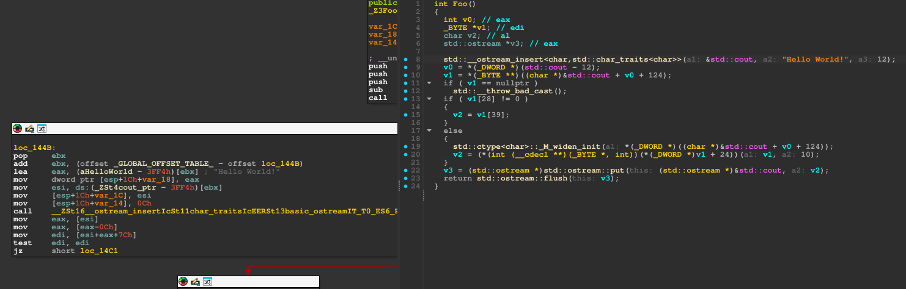<br>
      <b>Before the pass</b>
    </td>
    <td align="center">
      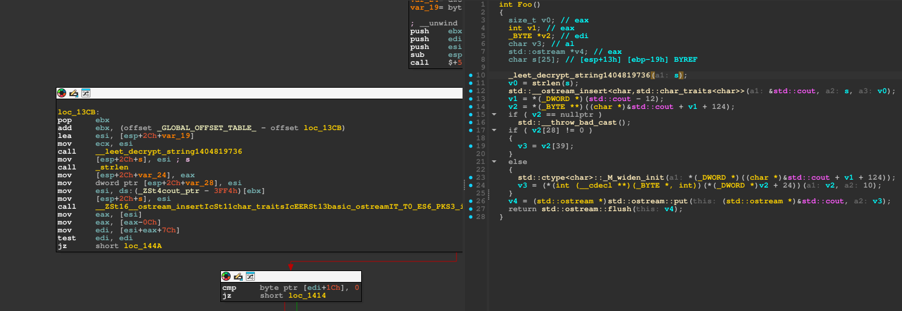<br>
      <b>After</b>
    </td>
  </tr>
</table>

### Mixed Boolean Arithmetic (MBA)

Replaces arithmetic operations with their MBA equivalents. It's basically impossible to see what the original operation did unless you run it through an MBA deobfuscator first. Of course this obfuscation is kinda weak because MBA is the oldest trick in the book, so there are many tools to deal with that, for example CoBRA, it will successfully deobfuscate this into the original expression:

```
./cobra-cli --mba "((x^y) - (((x^y)&0xFF)&0xA) + 10) * ((x^y) - ((x^y)|0xA) + 10) + ((x^y) - (((x^y)&0xFF)|0xFFFFFFF5) - 11) * (~(x^y) - (~(x^y)|0xA) + 10)" --bitwidth 32

10 * (x ^ y)
```

That's why I've made the AAMBA pass.

<table>
  <tr>
    <td align="center">
      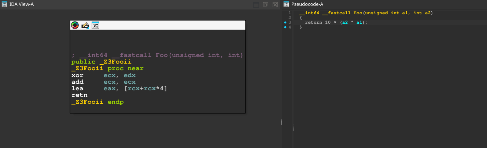<br>
      <b>Before the pass</b>
    </td>
    <td align="center">
      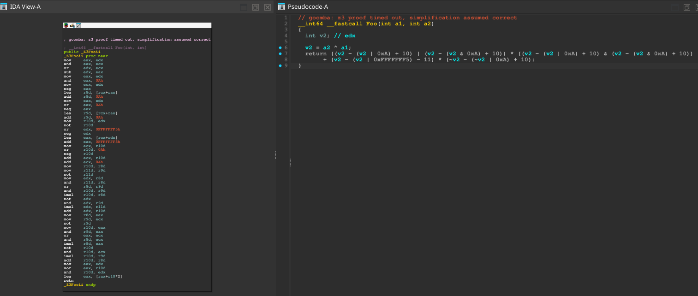<br>
      <b>After</b>
    </td>
  </tr>
</table>

### Architectural Hardening MBA (AAMBA)

Replaces operands of binary operations with `ADC(X, 255) - 255 - CF` and `SBB(X, 255) + 255 + CF`. Of course it always evaluates to `X`, but it makes the expression dependent on the carry flag. Unless the decompiler tracks the state of CF (which sometimes is impossible) it will get very confused and won't be able to fold these expressions. It pairs very nicely with the previous MBA pass obfuscating the arithmetic even further. As you can see below the decompiler created some additional variables and uses a lot of `__PAIR64__` and `__CFADD__` calls, so it becomes a lot harder (still not impossible) to paste that into tools like CoBRA, IDA's gooMBA plugin is also no help in simplifying this. Also, IDA's decompiler does track the carry flag to some degree, but combining this with control flow obfuscation makes tracking basically impossible without execution since you do not know what the previous operation was, maybe it set CF to 1, maybe it didn't, so later passes will add up even more to this one.

<table>
  <tr>
    <td align="center">
      <br>
      <b>Before the pass</b>
    </td>
    <td align="center">
      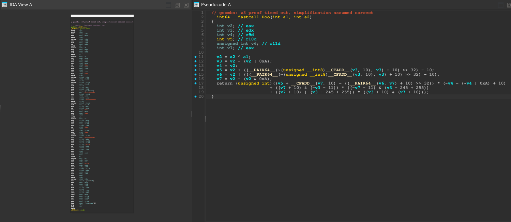<br>
      <b>After</b>
    </td>
  </tr>
</table>

### Control Flow Flattening

Collects all the blocks inside a function and makes one giant state machine out of them, it creates a jump table at the beginning of the function and places all the block pointers inside it. Then instead of a normal jump at the end of each block everything gets routed through the dispatcher which uses indirect jumps, these are almost impossible to resolve statically without any execution. It also demotes registers to stack, so if you split a block in half, all the variables from the previous block will be on the stack, which means that there will be A LOT of variables in every expression. If you run a single block's operations through CoBRA it won't be able to deobfuscate it much since there will be too many unknown variables.

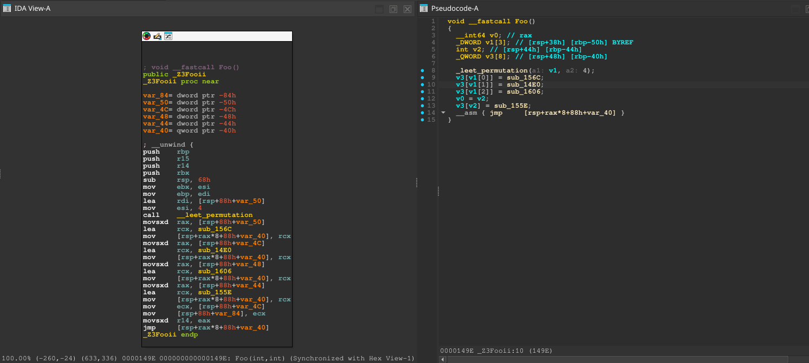
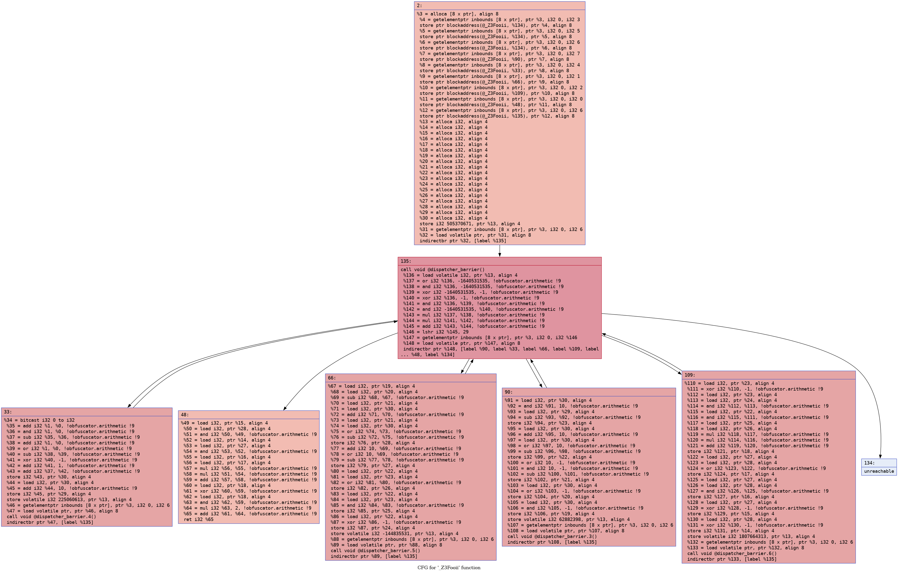

### Anti Analysis

Creates a bunch of bogus blocks containing invalid assembly. This throws disassemblers off immensely because if the disassembler encounters a technically invalid byte that never gets executed, it will still try to make sense of it. So if the byte is incomplete, it will create an instruction from whatever bytes happen to be after it essentially consuming them. That creates a desynch destroying every instruction after that. On Windows binaries IDA will be able to somewhat recover from this, in rare cases it will be able to generate a graph and decompile what it can (tho it will be broken and incomplete), while on Linux binaries it completely breaks the graph view and disables decompilation. Additionaly it will insert RDTSC timer checks, if it takes too long (for example when debugger is attached) you crash.

<table>
  <tr>
    <td align="center">
      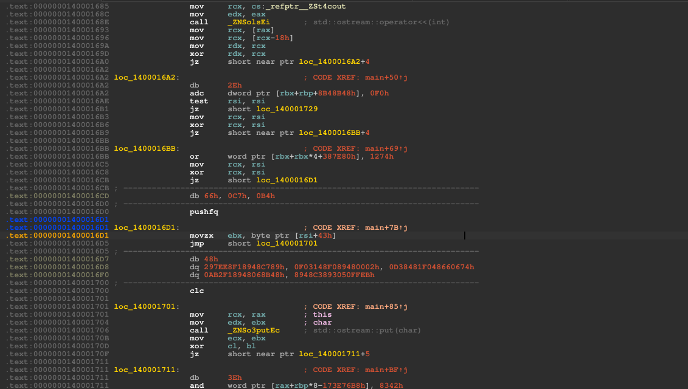<br>
      <b>Windows</b>
    </td>
    <td align="center">
      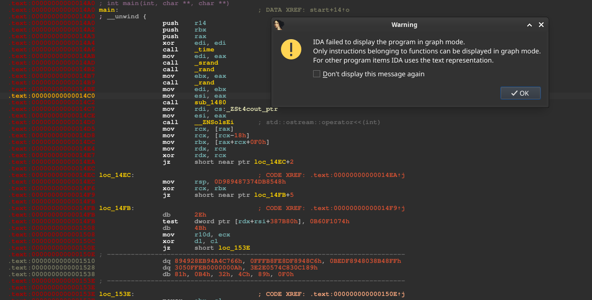<br>
      <b>Linux</b>
    </td>
  </tr>
</table>

On top of that, if the pass sees any instruction starting with `0xFF`, it inserts a single `0xEB` byte before it. This will create `JMP RIP+1`, so control flow is unchanged (RIP simply advances one byte into the original instruction), but disassemblers become desynchronized again.
Instructions beginning with 0xFF are mostly `INC/DEC` and indirect `JMP/CALL`. Sadly most of the ordinary calls and jumps are relative (`0xE8/0xE9/0xEB`) and stay unaffected. But the technique is especially useful with the dispatcher pass since everything there uses indirect jumps. It's not as useful for calls tho, the only calls that are affected by this are the indirect ones, typically virtual calls, calls through function pointers, and some external/library calls.

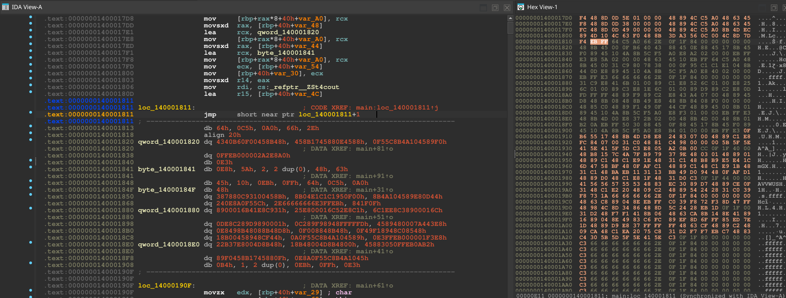

### Anti Aliasing

Throws every stack local in a function into one big shared stack buffer to which indices are computed at runtime. This way decompilers can't alias variables, which makes accesses to the same variable multiple times show up as accessing different values. This plays really nicely with the dispatcher since it demotes registers to stack, so there will be a lot of these stack slots.

<table>
  <tr>
    <td align="center">
      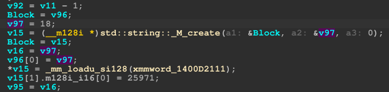<br>
      <b>Before the pass</b>
    </td>
    <td align="center">
      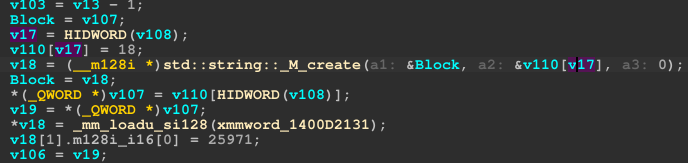<br>
      <b>After</b>
    </td>
  </tr>
</table>

### Nanomites

Obfuscates control flow through exceptions. It replaces all calls with `int3` traps. When the trap is triggered the control flow goes to the exception handler which adjusts `RIP` to the actual call. It also inserts invalid bytes right after the trap to desynchronize the disassembler even further.

<table>
  <tr>
    <td align="center">
      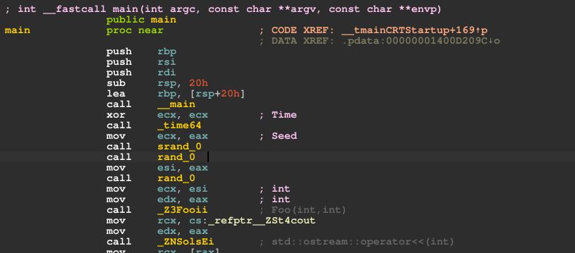<br>
      <b>Before the pass</b>
    </td>
    <td align="center">
      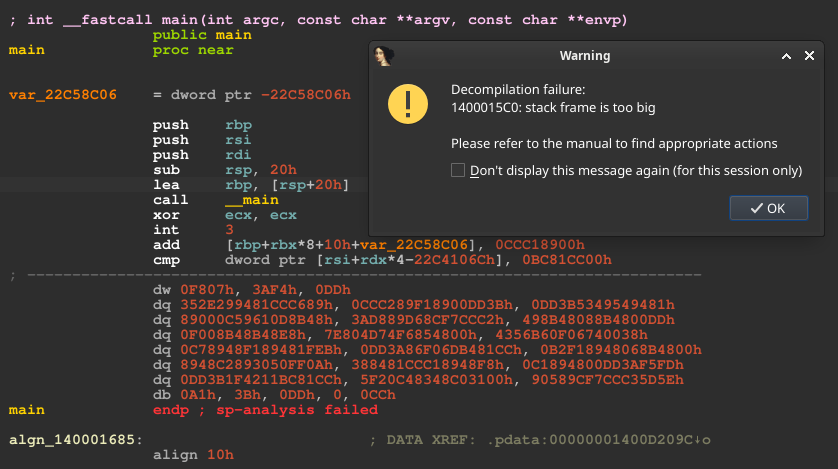<br>
      <b>After</b>
    </td>
  </tr>
</table>

## Combining Every Pass

By combining every pass static analysis becomes very hard without some extra tools that would deobfuscate this. Even if you somehow nop all the invalid bytes and you're able to decompile this to some pseudocode or at least get a graph view, you're still left with control flow obfuscation through exceptions and the dispatcher, and even if you break through that, there's a mountain of redundant MBAs, bogus blocks, stack variables and string encryption obfuscating the actual operations. Here are screenshots of the main entry point of a simple program containing that simple xor Foo function from before in all of the three big boy disassemblers. As you can see they can't make much of it.

<table>
  <tr>
    <td align="center">
      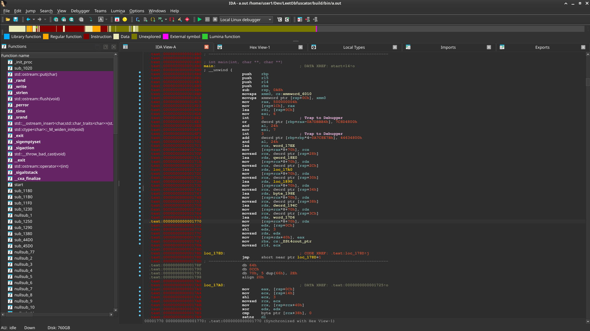<br>
      <b>IDA Pro 9.4</b>
    </td>
    <td align="center">
      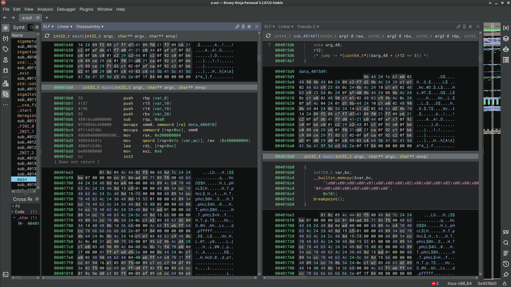<br>
      <b>Binary Ninja Personal 5.2</b>
    </td>
    <td align="center">
      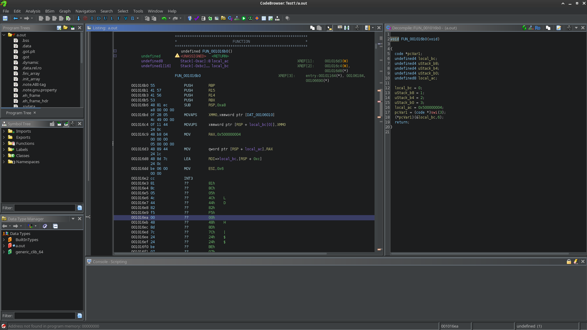<br>
      <b>Ghidra 12.1.2</b>
    </td>
  </tr>
</table>

I really wanted to include some kind of result of deobfuscators trying to make sense of this, but unfortunately I wasn't able to find any working ones with symbolic execution to see the actual control flow. All of the ones that I was able to find are either very limited to specific usecases (like deobfuscating VMProtect specifically), too old, not maintained and broken (almost every IDA/BN plugin I've tried), or are heavy machinery that requires too much manual guiding and setup through APIs I'm just not familiar with (Angr, Triton, IntelPin). If you know of any deobfuscators for arbitrary binaries that would be able to extract anything at all let me know.

## Performance

Of course inserting all this bullshit into the binary will slow it down immensely, over 200 times slower on the default settings on average:

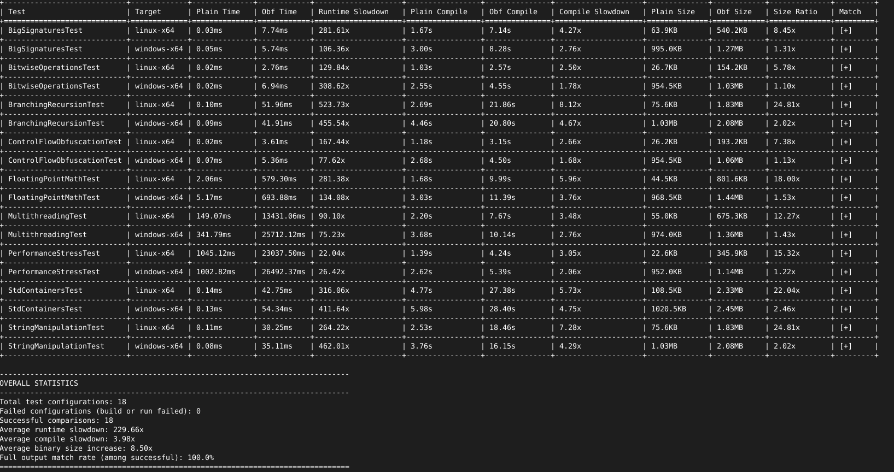<br>

Though it's not as bad as it looks because of 2 things. 1. almost 95% of the performance cost here is caused by nanomites, because well, interrupts are just slow. The exception has to leave to the kernel and come back to the app, that takes time. Without nanomites it's down to being only 7.5x slower:

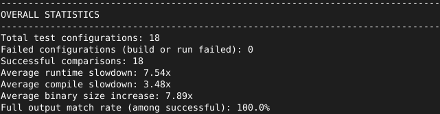<br>

So I highly advise to just mark the functions and calls you want to obfuscate with nanomites manually instead of just setting it to all. Obfuscating every call inside a binary is pointless and costs a lot. And the reason number 2. most of the time you don't really care about the performance of the things you want to hide. This obfuscator has the ability to get selectively enabled and disabled. So you can disable it for the performance critical sections of your code and enable it wherever it's actually needed. Nobody cares whether your license check takes 1ms or 0.001ms, it's still unnoticeable for a human.

For the configuration options and the full guide refer to the [wiki](https://github.com/Zydak/LeetObfuscator/wiki/Full-Guide).

You can also mark all the functions related to the exception handler inside `Leet.h` with `LEET_SKIP` macro, that way the exception handler won't get obfuscated by most of the passes which cuts the cost of the nanomites in half (on default settings), but also leaves you with an unobfuscated exception handler which I think is worse than a slight slowdown.

## Building

### Linux

Requirements:

- CMake
- Ninja
- Clang
- Mold (optional, if you don't want it delete `-DLLVM_USE_LINKER=mold` from cmake. But it will be faster with mold)

```bash
git clone https://github.com/Zydak/LeetObfuscator.git --recursive
cd LeetObfuscator

mkdir build
cd build

cmake ../leet-llvm-project/llvm -G Ninja -DCMAKE_C_COMPILER=clang -DCMAKE_CXX_COMPILER=clang++ -DLLVM_USE_LINKER=mold -DLLVM_USE_SPLIT_DWARF=ON -DLLVM_ENABLE_ASSERTIONS=ON -DCMAKE_BUILD_TYPE=RelWithDebInfo -DLLVM_ENABLE_PROJECTS=clang -DLLVM_TARGETS_TO_BUILD=X86 -DCMAKE_EXPORT_COMPILE_COMMANDS=ON
ninja clang
```

the modified compiler will be inside `build/bin/`, just use that to compile the source you want to obfuscate.

You also don't have to build it, there's a prebuilt binary in [releases](https://github.com/Zydak/LeetObfuscator/releases/), just download and unzip.

### Windows

Building this project for Windows is currently not supported. But crosscompiling with this project to Windows is. So if you really want to, you can grab the Linux binary and crosscompile the obfuscated app for Windows from Linux or WSL.

## Usage

For the complete guide on how to use this exactly refer to the [wiki](https://github.com/Zydak/LeetObfuscator/wiki/Full-Guide).

Example usage:

Copy [`Leet.h`](https://github.com/Zydak/LeetObfuscator/blob/main/Src/Leet.h) into your project, then inside one .c/.cpp file include it and define `LEET_IMPLEMENTATION`

do not define this in multiple modules!

```cpp
#define LEET_IMPLEMENTATION
#include "Leet.h"
```

then just compile the source with the built compiler:

```bash
./build/bin/clang++ ./test.cpp -o test -fno-exceptions
```

## Current Limitations

- Works only for x64 and x86 on both Windows and Linux.
- Only C++ has been tested intensively, but it should also be able to obfuscate C code.
- Has to be compiled with -fno-exceptions flag, so obviously no try catch in the obfuscated code.
- Basically a work in progress. Don't expect this to work for bigger projects (it probably won't, but you can try tho). It's not very well tested. I do have some tests written by LLMs, because I had no actual projects (except for the crackmes) on hand, but they hardly count as big applications. They're mostly singular files stress testing a specific part of C++. They caught a lot of errors, but again, new ones will probably pop up on bigger binaries, especially ones with multiple modules, so if you encounter any please open an issue.
